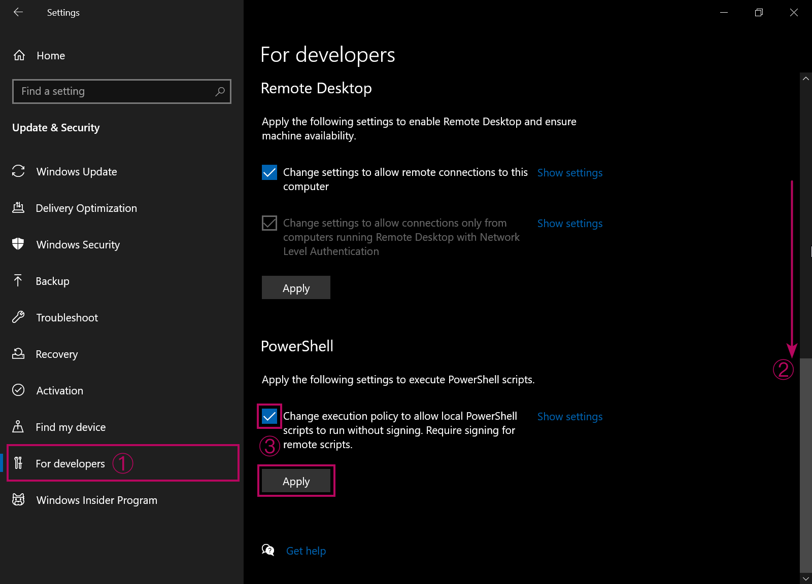

# ❀ A simple, user-friendly Powershell script to make use of yt-dlp video downloading on Windows
# ❀ 简单方便的yt-dlp视频下载器操作界面脚本

This script was written & deployed in panic due to my saved-for-later YouTube videos were removed for "not meeting community guidelines"
因油管河蟹，及不慎手抽而痛失收藏视频，遂慌而疾书所得（文言文太差，尽力了）

## ▲How to run ▲如何运行
- Lift PSScript running restriction under Settings-->Update & Security-->For Developers:
- 在设置-->更新和安全-->开发者选项中解除PowerShell的运行限制，如图：
 
